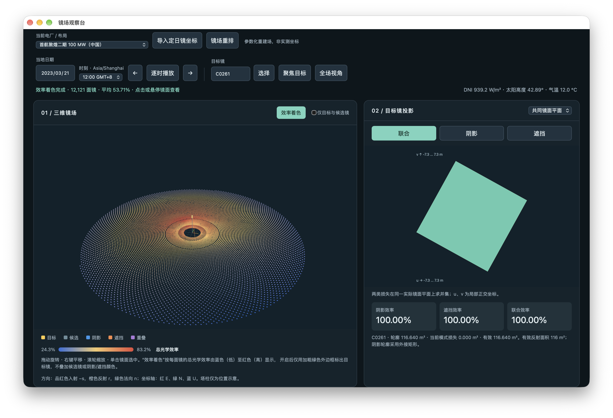

# heliostat-shadow

面向塔式光热电站的定日镜场几何、光学效率、排布比较与交互诊断工具。

项目使用统一的 ENU 坐标系计算太阳位置、定日镜姿态、阴影、反射光遮挡、余弦损失、镜面反射与清洁度损失、镜面至接收器的沿程大气衰减，以及有限圆柱接收器的截获损失。v1.3 将移动端所需的电厂数据、太阳位置、逐镜光学计算、坐标导入、镜场重排和用户状态迁移到共享 Rust 内核；Python 继续负责桌面研究工作流与数据处理。

> 当前结果是可复现的工程研究模型。只有 Gemasolar 随仓库提供公开研究重建坐标；其他目录电厂使用明确标注的参数化重建场，不能当作业主竣工坐标、现场测试或实际发电量。



## 当前能力

- 根据经纬度、海拔和带时区时刻计算太阳高度、方位及 ENU 太阳矢量。
- 使用 pvlib Ineichen 模型计算晴空 DNI、GHI 和 DHI。
- 根据太阳方向与瞄准点生成定日镜法向量、反射方向和四顶点。
- 使用通用多塔数据结构保存每座塔的位置、接收器以及每面定日镜的归属塔；旧单塔配置自动兼容。
- 在目标镜实际平面上精确合并阴影与遮挡区域，避免重复扣除重叠损失。
- 遮挡计算只保留目标镜至接收器之间、沿目标镜反射方向位于前方的镜面部分。
- 计算余弦、联合阴影/遮挡、反射率、清洁度、沿程透过率和接收器截获率。
- 加载 Gemasolar 2,650 面公开研究重建布局和 PVGIS-SARAH3 2023 历史卫星 DNI。
- 为全部目录电厂保存带来源和精度等级的 WGS 84 场址坐标，并在界面中直接显示。
- 生成、比较并优化 Campo 径向交错、非圆曲线和自由价值场三类排布。
- 在原生 macOS 窗口内联动显示三维镜场、二维投影、候选镜及逐镜效率。
- 切换电厂、导入镜位 CSV、持久化保存用户电厂并重新排列镜场。
- 使用 Rust 并行计算逐镜余弦、阴影、遮挡和联合效率；无 Rust 扩展时自动回退到经过校核的 Python/Shapely 路径。

## 多平台应用

当前版本为 **v1.0.2**。四个平台共享 Three.js 交互界面和 Rust 几何内核，但交付方式不同：

| 平台 | 应用形式 | 计算与数据模式 | 当前交付物 |
|---|---|---|---|
| macOS | 原生 WKWebView 窗口 | 本机 Python 服务 + Rust 内核，完整离线 | Apple Silicon DMG |
| Windows | 原生 WebView2 窗口 | 本机 Python 服务 + Rust 内核，完整离线 | x64 安装程序与便携 ZIP |
| iOS / iPadOS | SwiftUI + WKWebView | App 内置 Rust 内核、18 个电厂/布局和逐时 DNI，完全离线 | 模拟器包；真机需开发者签名 |
| Android | 原生 WebView | App 内置 Rust 内核、18 个电厂/布局和逐时 DNI，完全离线 | 可侧载 APK |

移动端不依赖电脑、局域网服务、SciPy、Shapely 或 Python 运行时。App 从自身资源包读取电厂和 DNI 数据，通过原生桥直接调用 Rust；电厂切换、CSV 坐标导入和三类镜场重排结果保存在设备本地。移动界面把三维镜场与目标镜投影放在页面中心，说明与候选表等次要内容隐藏，导入和重排收纳到页面底部的“镜场设计”。

平台构建说明分别见 [macOS](macos/README.md)、[Windows](windows/README.md)、[iOS](ios/README.md) 和 [Android](android/README.md)。GitHub Actions 在每次推送时分别验证 Rust/Python、Windows、Android 和 iOS 模拟器构建。

## macOS 应用

从 [GitHub Releases](https://github.com/hustquick/heliostat-shadow/releases/latest) 下载最新的 `Heliostat-Viewer-macOS-arm64-v<版本号>.dmg`，打开后将“塔式镜场设计与优化”拖入 Applications。

当前版本支持 Apple Silicon 和 macOS 12 或更高版本。应用内置 Python 运行时、Rust 计算内核、前端和基础数据；双击后在原生 `WKWebView` 窗口内打开，不会跳转到外部浏览器，也不需要用户输入启动命令。

当前安装包使用本地临时签名，尚未使用 Apple Developer ID 公证。首次打开下载版本时，可能需要在 Finder 中右键应用并选择“打开”。构建与打包说明见 [macOS 文档](macos/README.md)。

### 塔式镜场设计与优化功能

- 在 14 座公开塔式电厂参数记录以及 Gemasolar 参考场、Campo、非圆曲线、自由排布之间切换。
- 按电厂切换塔高、接收器尺寸、定日镜尺寸、有效面积和光学参数。
- 显示当前电厂经纬度及“精确项目场址 / 公开项目场址 / 项目场址近似坐标”等来源口径。
- 在控制区直接显示当前全场的定日镜外形、宽度、高度、有效反射面积与公开镜心离地高度；混合规格显示尺寸范围。离地高度缺少可靠公开来源时明确显示“未查到公开数据”，不会用模型 `z` 坐标代替。
- 旋转、缩放和平移完整三维镜场，点击镜面或输入编号选择目标镜。
- 切换联合、阴影、遮挡模式，并查看共同镜面平面或光线法向投影平面。
- 显示候选镜、深度裁剪结果、实际重叠镜及每个候选被排除的原因。
- 逐时播放，按当地日期和 UTC 偏移正确处理夏令时；夜间不生成虚假的跟踪姿态。
- 使用蓝—黄—红色带显示逐镜总光学效率，绿色粗边框标出目标镜。
- 悬停或选中镜面后显示总效率及余弦、联合损失、沿程和截获等分解。
- 导入至少包含 `x,y` 的 ENU 坐标 CSV；可选字段会覆盖当前电厂的默认参数。
- 用 Campo、非圆曲线或自由价值场方法生成独立镜场设计，在 04「镜场设计」选择设计方式与当前布局；顶部列表只显示电厂。
- 每个设计记录来源电厂标识，原厂镜场和重排方案共用该电厂的位置、时区、天气与气温资料，不为每个方案复制天气序列。

用户导入的电厂和重排结果保存在：

```text
~/Library/Application Support/Heliostat Viewer/
```

升级应用不会覆盖这些数据。目录缓存包含模型版本指纹；电厂参数更新后会自动重建旧缓存。

## Python 环境与快速运行

项目约定使用 `~/venv`：

```bash
test -d "$HOME/venv" || python3 -m venv "$HOME/venv"
source "$HOME/venv/bin/activate"
python -m pip install -r requirements.txt
python -m pytest -q
```

太阳位置与晴空辐照度示例：

```bash
python -m examples.gemasolar --time "2026-06-21 12:00:00"
```

六面镜合成场示例：

```bash
python -m examples.field_demo --time "2026-06-21 08:00:00"
```

开发模式下启动交互界面：

```bash
python -m scripts.serve_viewer
```

然后访问 `http://127.0.0.1:8765`。本地服务只监听回环地址；Three.js 已固定版本并随仓库保存，运行界面不依赖 CDN 或 Node.js。最终用户应优先使用 macOS 应用。

## 坐标系与方向约定

统一使用右手 ENU 坐标系：

```text
x = East（东）
y = North（北）
z = Up（上）
```

太阳方位角从正北顺时针增加：北 0°、东 90°、南 180°、西 270°。若太阳高度角为 `α`、方位角为 `γ`，从镜场指向太阳的单位矢量为：

```text
s = (cos α sin γ, cos α cos γ, sin α)
```

太阳光的实际传播方向为 `d_sun = -s`。对第 `i` 面镜：

```text
r_i = normalize(aim_point_i - centre_i)
n_i = normalize(s + r_i)
```

其中 `r_i` 是目标镜指向其瞄准点的反射方向，`n_i` 是满足反射定律的镜面法向量。所有局部几何长度使用米；经纬度只用于太阳位置，不能直接当作镜场平面坐标。

## 阴影与遮挡几何

阴影和遮挡采用同一套“目标镜局部投影—多边形并集”结构，但光线方向不同：

- 阴影沿 `s` 判断太阳上游镜面。
- 遮挡沿目标镜自己的 `r_i` 判断反射光路前方镜面。

算法先用包围球横向距离作保守筛选，再使用完整四顶点做三维深度裁剪。遮挡候选必须至少有有限面积部分位于目标镜前方，同时至少有一部分位于目标镜与接收器参考平面之间。算法不只按镜面中心判断，因此可以处理倾斜镜面跨越目标平面或接收器平面的边界情况。

候选多边形沿物理光线投回目标镜实际平面后求并集：

```text
U_shadow = union(shadow polygons)
U_block  = union(blocking polygons)
U_loss   = union(U_shadow, U_block)
eta_joint = area(target - U_loss) / area(target)
```

因此，同一面镜或多面镜产生的重叠阴影/遮挡只扣除一次。`eta_shadow × eta_blocking` 不是精确的联合效率。二维诊断、三维着色和批量计算使用同一份后端几何结果，前端不另写遮挡判定。

## 总光学效率

本项目将到达接收器表面的逐镜总光学效率定义为：

```text
eta_optical = eta_cosine
              × eta_joint
              × mirror_reflectivity
              × mirror_cleanliness
              × eta_atmosphere
              × eta_intercept
```

各项按光路顺序相乘，损失百分比不能直接相加：

1. `eta_cosine`：实际镜面法向与太阳方向的余弦。
2. `eta_joint`：同一实际镜面上的阴影/遮挡联合有效面积比例。
3. `mirror_reflectivity`：镜面材料反射率场景。
4. `mirror_cleanliness`：固定清洁度场景。
5. `eta_atmosphere`：镜面到瞄准点的沿程大气透过率。
6. `eta_intercept`：等效高斯光斑被有限圆柱接收器截获的比例。

沿程模型采用 Noone、Torrilhon 与 Mitsos 的约 40 km 能见度经验式。历史 DNI 已包含太阳到地面的衰减；这里仅计算镜面到接收器的反射光路，不会重复衰减太阳入射光。

接收器截获率把太阳张角、镜面斜率误差和跟踪误差合成为角度标准差，并在圆柱接收器近侧表面数值积分。它是可复现的等效光斑模型，不是 SolTrace 式逐光线通量图，也没有模拟多点瞄准、分片曲率、管束间隙或接收器热流密度约束。

光学效率止于接收器表面。`simulation.evaluate` 还可继续乘接收器太阳吸收率和热效率场景，但这些结果不是温度相关的对流/辐射热平衡，也不是电功率或发电量模型。

## 电厂目录与数据边界

`data/power_tower_catalog.json` 当前包含：

- PS10、Crescent Dunes、Khi Solar One、Cerro Dominador、NOOR III；
- 首航敦煌一期与二期、中电建青海共和、鲁能海西；
- 中控德令哈 10 MW 与 50 MW、中电工程哈密、玉门鑫能二次反射项目。

每座电厂分别保存塔高、接收器半径/高度、定日镜宽度/高度/有效面积、反射率、清洁度、斜率误差和跟踪误差。公开资料缺少接收器或镜面外框尺寸的条目会标为 `per-plant-estimate`；这些显式估值不会被描述成现场测量值。

### v1.1 多塔数据结构

电厂配置使用 `schema_version: "1.1"` 和 `towers` 数组。每座塔都有独立的 ID、名称、ENU 塔基坐标，以及圆柱接收器的中心、半径和高度。布局 CSV 可增加 `tower_id`，明确每面定日镜把反射光送往哪座塔。光学计算按 `tower_id` 选择对应接收器，沿程距离、反射方向、遮挡截止面和截获率均由该镜自己的瞄准点及归属塔决定。

```json
{
  "schema_version": "1.1",
  "towers": [
    {
      "id": "tower-east",
      "name": "东塔",
      "base": [500.0, 0.0, 0.0],
      "receiver": {"centre": [500.0, 0.0, 200.0], "radius": 6.0, "height": 16.0}
    },
    {
      "id": "tower-west",
      "name": "西塔",
      "base": [-500.0, 0.0, 0.0],
      "receiver": {"centre": [-500.0, 0.0, 200.0], "radius": 6.0, "height": 16.0}
    }
  ]
}
```

旧配置中的 `optical_height_m`、`receiver_radius_m` 和 `receiver_height_m` 会在读取时自动升级为 `tower-1`，因此原有单塔电厂、CSV 和研究脚本继续可用。数据库已加入“三峡恒基能脉瓜州 100 MW 双塔一机”参数化重建场。两座塔东西相距约 1 km，固定分区镜面服务各自塔，重叠区镜面使用 `tower_id: "auto"`。每个计算时刻都让每面共用镜分别朝向两座塔，计算余弦效率、联合阴影/遮挡效率、沿程透过率和接收器截获率，再逐镜选择总光学效率更高的塔；不是按区域或距离一次性划分。反射率与清洁度对两塔相同，不影响二选一结果。该覆盖计算已进入 Rust 批处理接口，并保留 Python 对照路径。公开资料没有逐镜竣工坐标和接收器完整外形，因此镜场边界、镜面长宽比及接收器尺寸仍明确标为建模估值。

全部 14 条目录记录都保存 WGS 84 经纬度、坐标来源、精度等级和边界说明。Crescent Dunes、Khi Solar One、Cerro Dominador 光热阶段和 NOOR III 使用来源明确标为 exact 的项目场址；PS10 与 Gemasolar 使用更细的公开项目场址；中国双塔项目的区域近似位置单独标识，不冒充塔中心坐标。界面统一显示六位小数只是格式约定，三位小数来源不会因此变成测量级精度。坐标用于太阳位置计算，仍不能代替塔中心测量控制点或逐镜 ENU 坐标。逐项来源见 [数据说明](data/README.md)。

首航敦煌二期模型采用公开的 263 m 塔高、10.8 m × 10.8 m 定日镜、直径 19.2 m × 高 40 m 外置圆柱接收器、78 个环向排和约 1500 m 最远镜距离。公开镜数存在 11,935、约 12,000 和 12,121 三种口径；应用采用目录主源的 12,121 面。逐镜坐标仍是受这些参数约束的径向交错重建，不是竣工坐标。

三峡恒基能脉瓜州双塔模型采用三峡集团采购公告公布的 26,944 面定日镜、29.7 m² 单镜面积、2.5 m 镜心标高和 190 m 吸热塔中心标高，以及三峡集团报道的东西双塔约 1 km 间距与部分重叠镜场。公开报道所称“约 2.7 万面”和另一篇工程报道的 26,954 面属于不同口径；模型采用采购公告的 26,944 面。接收器半径 7 m、高 18 m 是显式估值，不是竣工参数。

Gemasolar 是当前唯一随仓库提供公开研究重建镜位的电厂。数据来自固定版本的公开布局仓库，历史辐射来自 PVGIS-SARAH3 2023 卫星数据。原文件、请求、版本和哈希均保留在 `data/raw/` 和 `data/source_manifest.json`。完整来源、许可证及参数冲突见 [数据说明](data/README.md)。

## 自定义镜场 CSV

Python 的严格布局接口 `field.load_layout(path)` 使用以下字段：

```csv
mirror_id,x,y,z,width,height,aim_x,aim_y,aim_z,roll_deg,mount_type,tower_id
```

其中 `mirror_id`、`x`、`y`、`z`、镜面尺寸和瞄准点必须有效；`mount_type` 可取 `projected_east` 或 `azimuth_elevation`，`tower_id` 指向电厂配置中的塔。旧 CSV 缺少 `tower_id` 时自动使用 `tower-1`。ID 必须唯一，尺寸必须为正，瞄准点不能与镜面中心重合。

应用内导入只强制要求 `x,y`，缺少的尺寸、塔高、接收器和瞄准点参数由导入面板填写或从当前电厂取得。导入真实数据前应记录：

- 坐标轴方向、单位、原点与整体旋转；
- 镜面中心高程和塔高的共同基准；
- 镜面外框与实际反射面积的区别；
- 瞄准点定义和接收器坐标；
- 数据来源、许可证和测量精度。

## Gemasolar 历史计算

完整流程：

```bash
source "$HOME/venv/bin/activate"
python -m scripts.fetch_gemasolar
python -m scripts.prepare_gemasolar
python -m scripts.run_gemasolar
python -m scripts.audit_gemasolar
python -m scripts.plot_gemasolar
python -m scripts.summarize_gemasolar
```

已缓存原始数据时可跳过下载。默认计算 2023 年四个季节日期的全部 24 小时及 2,650 面镜；四日结果不会被外推成全年发电量。输出包括逐镜、逐时、逐日功率与损失分解，位于 [2023 年算例报告](reports/gemasolar_2023/RESULTS.md)。

自定义日期：

```bash
python -m scripts.run_gemasolar --dates 2023-07-15
```

DNI 读取器严格要求双轴跟踪面法向直射分量，并检查时间完整性、非负性、单位和重复记录。

## 排布比较与优化

项目包含三类统一数量的候选场：

- **Campo**：三分区径向交错场；
- **非圆曲线**：在径向交错场上加入南北和方位相关形变；
- **自由价值场**：从黄金角候选点中按光学价值、最小镜距和南北容量约束选择。

文献 Campo 方法比较：

```bash
python -m scripts.compare_layouts
```

输出位于 [布局比较报告](reports/layout_comparison/RESULTS.md)。文献未公开的 HFLCAL 原始裁剪程序没有被假装复现；当前结果是“公开排布规则复现 + 本项目统一裁剪与光学评价”。

三类排布搜索与完整光学复核：

```bash
python -m scripts.optimize_three_layouts
```

输出位于 [三类排布优化报告](reports/three_layout_optimization/RESULTS.md)。第一阶段用四季太阳位置快速筛选，第二阶段对入围方案执行完整阴影、遮挡和接收器光学链。当前结果用于比较方法，不构成全年全局最优性证明。

### 逐镜最大净增益贪心实验

优化器可用于目录中的任一单塔电厂。每一轮都考察全部镜子：先为每面镜在合法空位中筛选高价值位置，再把排名靠前的移动放回完整镜场，重新计算阴影、遮挡、沿程透过率和接收器截获。只有全场接收功率的实际净增益超过阈值，才接受该移动。

```bash
~/venv/bin/python scripts/optimize_field_greedy.py --plant ps10 --max-moves 60 --relative-gain-limit 2e-4
```

例如，PS10 基准实验采用春分、夏至、秋分和冬至正午的晴空 DNI 等权代表全年，停止阈值为基准代表性接收功率的 0.02%。结果位于 [PS10 贪心优化报告](reports/ps10_greedy_final/RESULTS.md)：接受 28 次移动后，下一候选的完整全场增益为 27.4 kW，低于约 32.0 kW 阈值而停止；代表性接收功率指标提升 1.728%，光学效率由 59.736% 提升至 60.768%。[逐轮记录](reports/ps10_greedy_final/move_history.csv)、[最终坐标](reports/ps10_greedy_final/ps10_greedy_layout.csv) 与 [前后排布图](reports/ps10_greedy_final/layout_comparison.png) 可用于复算与查看。

默认停止阈值为基准代表性接收功率的 0.001%，以避免大镜场把几十千瓦级的实际正增益过早丢弃；可用 `--relative-gain-limit` 按研究需要提高或降低。候选区域可设为 `global`（全场重定位）或 `local`（当前镜位周围九个方向的微调）。当前通用版接受目录中单塔场。双塔场还需要将“镜位移动”和“逐时择优指派到哪一座塔”合并为同一优化变量，因此会在加入这一目标后开放。多数目录场没有公开逐镜竣工坐标，且四个代表时刻不能代替 TMY 8760 小时的年能量评估。将 `annual_representative_samples` 替换为带权的气象年样本后，贪心逻辑与全场验收规则保持不变。

运行时间估算：

```bash
~/venv/bin/python scripts/estimate_optimizer_runtime.py
```

脚本会在本机测量 PS10 的候选筛选和一次完整几何计算，再按镜数和场内候选重叠规模估算目录电厂的 30 次、60 次移动所需时间。完整阴影/遮挡几何已经调用 Rust 内核；[时间估算报告](reports/optimizer_runtime_estimates/RESULTS.md) 显示，在当前四个代表时刻设定下，Python 筛选并非主瓶颈。扩展到逐时气象年时，应优先把多时刻批处理与候选全场复核进一步移入 Rust，而不是降低几何验收标准。

## 验证状态

当前完整测试：

```text
139 passed
```

覆盖范围包括：

- NREL SPA 公开太阳位置参考、时区、夏令时、夜间和异常输入；
- 反射定律、镜面共面性、四边尺寸、投影面积余弦关系；
- 无遮挡、全遮挡、部分遮挡、重复遮挡并集和三维深度边界；
- 候选镜位于目标后方、接收器之后或跨越裁剪平面的情况；
- 独立三维光线/矩形求交与二维多边形结果的数值核对；
- 联合阴影/遮挡面积收支、沿程模型和接收器积分收敛；
- 数据完整性、三类布局、空间约束、应用 API 和 macOS 打包后服务。

v1.0.6 的首航敦煌二期春分北京时间 12:00 回归结果为：12,121 面镜、78 排、最外半径 1500 m，全场平均总光学效率约 53.71%，最低约 24.32%，没有低于 10% 的镜子。最低值来自太阳来向外圈的余弦与截获损失，并非重复扣除阴影/遮挡。该数值仍受参数化镜位、大气能见度、斜率误差和瞄准策略假设影响，不能当作现场性能验收值。

## 已知限制

- 除 Gemasolar 外，目录电厂没有公开逐镜竣工坐标。
- 地形目前按共同平面处理，未模拟坡度、塔身阴影、道路和禁布区。
- 镜面按不透明矩形处理；分片缝隙通过有效反射面积比例表示，不逐片追踪。
- 接收器采用有限圆柱等效模型；腔式和二次反射项目只是明确标注的近似。
- 未实现真实多点瞄准、接收器通量均匀性、热应力或动态限流控制。
- 清洁度、能见度、斜率误差和跟踪误差不是逐时现场测量。
- 当前优化以有限代表时刻筛选，不是完整年度经济优化。

## 项目结构

```text
heliostat-shadow/
├── solar.py                  # 太阳位置、ENU 方向与晴空辐照度
├── heliostat.py              # 定日镜姿态、反射方向和四顶点
├── transform.py              # 投影基与三维到二维变换
├── shadow.py                 # 阴影投影、裁剪、并集和面积效率
├── blocking.py               # 目标镜反射方向上的遮挡效率
├── simulation.py             # 全场缓存、联合损失和完整光学链
├── optics.py                 # 镜面到接收器的沿程透过率
├── receiver.py               # 有限圆柱接收器截获积分
├── tower.py                  # 多塔与接收器数据结构、旧配置升级
├── layouts.py                # Campo、非圆曲线和自由场生成
├── field.py                  # CSV 布局加载与校验
├── datasets.py               # 公开布局与历史辐射准备
├── rust/                     # 跨平台阴影/遮挡计算内核与原生接口
├── viewer/                   # 三维—二维交互界面与工作区管理
├── macos/                    # 原生 WKWebView 应用与图标
├── windows/                  # WebView2 桌面应用与安装程序
├── ios/                      # SwiftUI/WKWebView 应用
├── android/                  # Android WebView 应用
├── data/                     # 数据、参数、原始来源和哈希
├── scripts/                  # 下载、计算、核查、优化、作图与打包
├── reports/                  # 数值结果、图表和验收记录
├── examples/                 # 太阳接口与六镜合成示例
└── tests/                    # 几何、光学、数据与应用测试
```

## 构建 macOS 安装包

在 Apple Silicon Mac 上：

```bash
source "$HOME/venv/bin/activate"
python -m pip install -r requirements-build.txt
./scripts/build_macos_app.sh 1.0.2
```

输出位于 `dist/macos/`：

```text
塔式镜场设计与优化.app
Heliostat-Viewer-macOS-arm64-v1.0.2.dmg
Heliostat-Viewer-macOS-arm64-v1.0.2.dmg.sha256
```

## 主要参考

- pvlib solar position 与 Ineichen 晴空模型：<https://pvlib-python.readthedocs.io/>
- NLR/SolarPACES 全球 CSP 项目数据库：<https://solarpaces.nlr.gov/>
- HelioCon 定日镜与电厂资料：<https://heliocon.org/resources/plant_information_overview.html>
- 《中国光热产业蓝皮书 2024》：<https://www.solarpaces.org/wp-content/uploads/2025/03/Chinas-CSP-blue-book-2024.pdf>
- Noone, Torrilhon & Mitsos (2012)：<https://doi.org/10.1016/j.solener.2011.12.007>
- Collado & Guallar Campo 方法：<https://doi.org/10.1016/j.renene.2012.03.011>

更细的数据来源、参数口径和许可信息见 [data/README.md](data/README.md)。

## 镜场设计工具（所有平台共用）

应用名称为“塔式镜场设计与优化”。选镜只更新目标信息，不自动移动相机。
“仅目标与候选镜”仅显示目标镜及有实际投影交集的遮挡镜；归位图标按显示区纵横比适配实体大小。

“导出全场坐标”生成 UTF-8 CSV，包含镜面编号、ENU 中心坐标及当前展示法向。
Android 使用系统文件保存器，iOS 使用文件导出器，macOS 使用保存面板，Windows 使用下载保存。

“镜面朝向与图案展示”支持输入镜面编号，或用 y 坐标及行半宽选择一行镜子；
法向偏离竖直角为 0° 时镜面水平。也可导入文字或图案图片：图片在镜场范围内映射，
黑色区域的镜面设为水平，白色区域保留跟踪姿态。
这是展示模式，原来的光学效率计算不包含这些姿态修改，二维投影暂时隐藏；点击“恢复跟踪”退出。


## v1.0.1 更新

统一四个平台的名称、图标与镜场设计工具：全场坐标导出、按编号/行编辑镜面朝向、
多行文字和图片图案。图案镜面在所有着色模式中保持灰色，其他镜面可显示效率或目标塔。
选镜不改变相机；主动切换视图采用平滑相机过渡；候选镜表格仅列实际面积交集。
macOS 提供 ⌘Q 退出及标准编辑快捷键。

自定义朝向是图案展示功能，尚未参与光学效率重算。iOS 的 GitHub 发布包用于模拟器，
真实 iPhone 安装仍需要 Apple 签名；四个平台构建通过不代表已完成四平台实机测试。

### 桌面菜单

macOS 菜单栏和 Windows 窗口菜单均提供文件、镜场、视图、图案、时间、帮助入口。可直接导入/导出全场坐标、重排镜场、调整镜面朝向、添加文字或图片图案、恢复跟踪、切换着色及逐时播放。添加文字会打开编辑区，输入后选择“生成当前文字图案”。图案仅改变展示姿态，效率仍对应太阳跟踪姿态。

快捷键：Command（Windows 为 Ctrl）+ O 导入坐标、+ S 导出坐标；+ 1 全场、+ 2 聚焦目标、+ 3 等轴测、+ 4 俯视。macOS 的 Command + Q 退出应用。

### 聚光启停

在“聚光启停参数”中设置启动和停止的 DNI（W/m²）及太阳高度角（°）临界值，桌面端也可从“镜场”菜单打开。启动需同时满足 DNI > 启动值、高度角 > 启动值；白天停止需同时满足 DNI < 停止值、高度角 < 停止值。临界值相等或只满足一项时保持前一状态。太阳高度角 ≤ 0° 强制停止，初次打开电厂从停止状态开始判断。

默认启动值为 200 W/m²、10°，停止值为 100 W/m²、5°，仅为演示设置，可按电厂修改。设置按电厂应用于当前运行；设备允许时会尝试保存，但桌面服务更换端口后应重新核对。停止时所有镜面以原镜心和尺寸朝下水平停放，聚光输出记为 0，不显示跟踪效率和有效光路；自定义图案暂停展示，启动后恢复。该功能是仿真启停与零位展示，不连接真实定日镜控制器。

逐时播放时，状态消息和天气信息各自占用固定两行高度；长文本在本区域内滚动，不改变三维场景的位置。此布局由 macOS、Windows、iOS、Android 共用。

## 双塔选塔研究（不集成到客户端）

客户端只使用旧方案；以下新方案仅保留用于离线理论研究：

- **单镜效率优先（旧方案，默认）**：各镜基于共同初始姿态比较自己的完整光学链，随后同时分配目标塔。速度较快，但不保证全场功率增加。
- **全场收益优先**：位置固定，以旧方案实际分配为起点，试算每个共享镜切换到另一座塔的全场净收益，每轮仅接受净收益最大的正收益切换，立即更新真实姿态，再评价下一轮。将切换镜自身与受影响邻镜的能量变化一起计算。采用包围球与入射、反射光线柱的保守筛选覆盖切换前后的影响，并用多边形交并差计算实际损失。

DNI、统一反射率和清洁度是同一时刻整个模型的公共倍率，选取最大增益时可约去；镜面面积仍参与全场贡献求和。收益记录以等效面积（m²）表示，可乘 DNI、反射率和清洁度得到相应功率增益。本算法最大化接收器截获功率，不包含接收器容量、峰值通量、切换耗时或电收益约束。

内核参数 `tower_switch_gain_threshold_m2` 默认 `1e-6`，`tower_switch_max_rounds` 默认 32。结果携带每次切换的镜号、原塔、新塔和净增益；只有停止原因为 `gain_threshold` 才表示达到当前单镜切换阈值，`round_budget` 表示预算结束，不能称为收敛或全局最优。各时刻确定性求解，暂未加入上一时刻热启动、最短保持时间和切换成本。

瓜州双塔参数化重建模型共 26,944 面镜。一次 32 轮串行试算实测约 138.06 秒（本地 Apple Silicon，结果见 `reports/dual_tower_serial_32rounds.json`），全场截获指标相对旧方案提升约 0.0415%，预算结束时尚未收敛。耗时已超过 2 秒，因此四端均已移除新方案，保留旧方案。缓存命中时间不代表首次求解时间。该模型并非电厂竣工坐标，优化结果属于模型分析。

四个平台客户端仅使用原有单镜选塔方案，不提供串行全场收益方案入口。串行方案仅通过研究接口运行，避免长时间搜索阻塞交互。

### 离线逐时气温

14 个目录电厂随包提供 2025 年 ERA5-Land 2 m 逐时气温，每个位置覆盖 8,760 个 UTC 小时；数据通过 Open-Meteo 历史气象接口取得，为再分析估算，非电厂现场实测。Gemasolar 及其布局保留原有历史气温。来源及坐标、请求地址记录在 `data/temperature_archive.json`，可用 `python scripts/fetch_temperature_archive.py` 更新；数据依据 CC BY 4.0 使用并在界面 07 卡片提供来源链接。自定义场址或不匹配的数据年份采用显式标注的季节与昼夜温度示意模型，不能用作工程气象依据。四端均离线读取同一温度序列；DNI 的原有历史/晴空数据来源保持独立。
