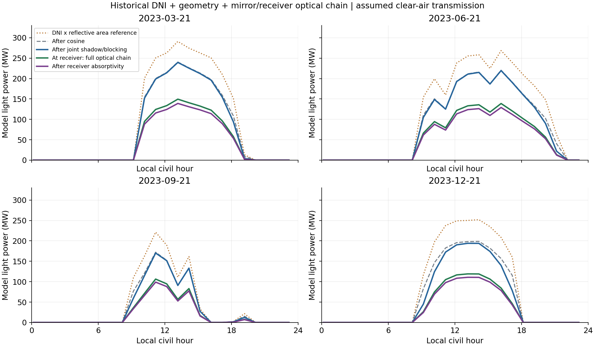
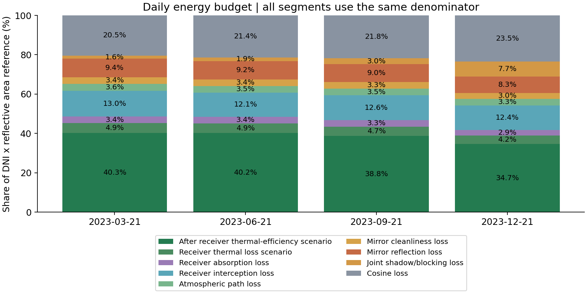
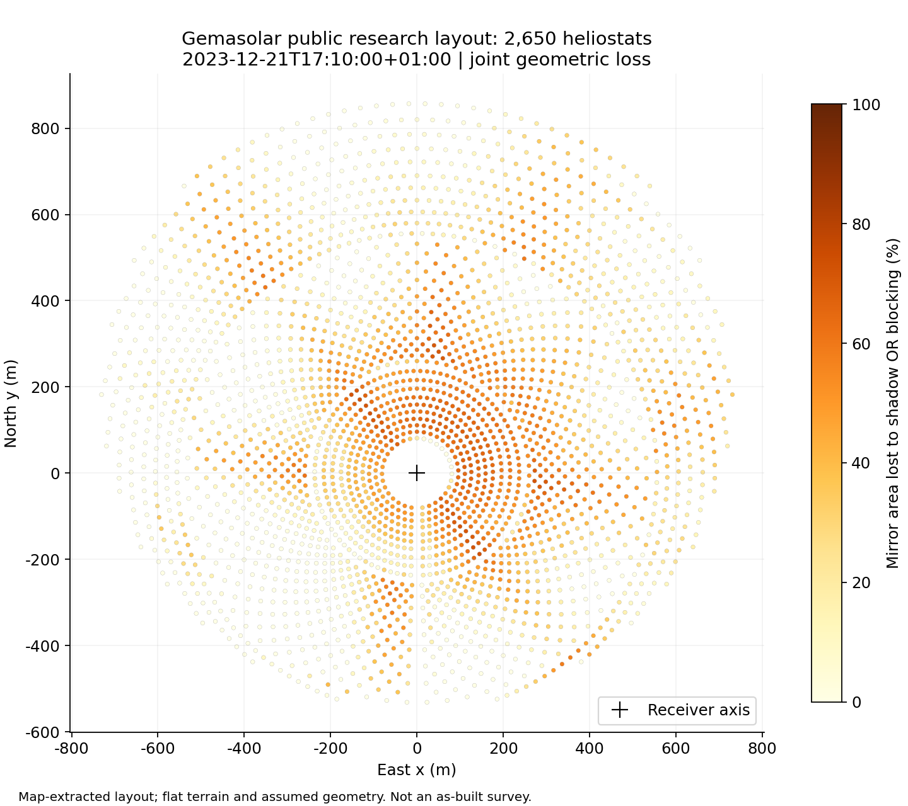
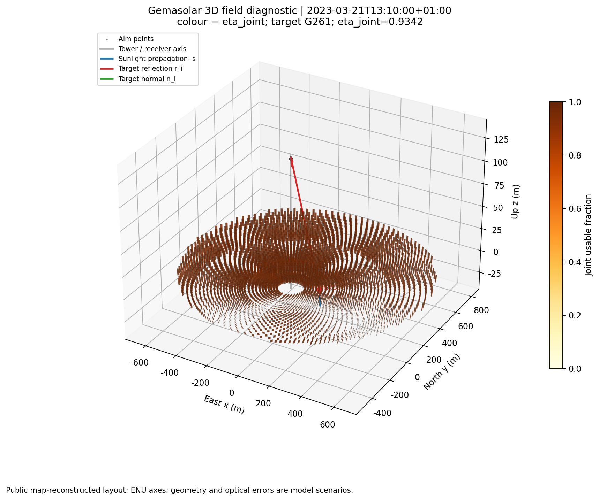
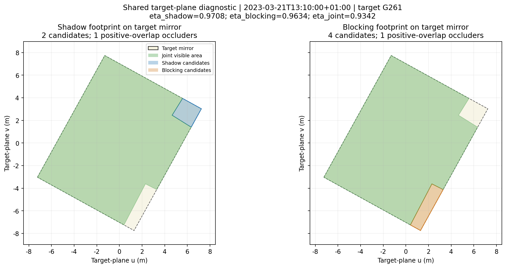
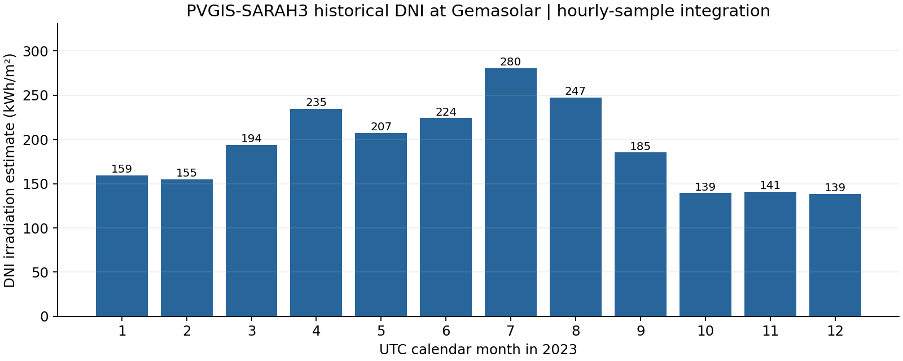

# Gemasolar 历史 DNI 与镜场完整光学链计算

计算对象为公开提取的 Gemasolar 2,650 面镜研究重建布局；辐射输入来自欧盟 PVGIS-SARAH3
的 2023 年历史卫星数据。**不是业主竣工坐标、现场 DNI 实测或实际电站发电量验证。**

## 数据与计算范围

- 全年输入：8,760 条小时采样记录，原时间为 UTC 每小时 :10，0 个缺失/重复时间。
- 年 DNI 辐照量约 **2305.98 kWh/m²**，由小时采样乘 1 h 近似积分。
- 几何计算：4 个指定当地日期、96 个小时记录，其中 48 个日间时刻逐一计算全部 2,650 面镜，
  共 **127,200 条镜面—时刻结果**。夜间功率置零，几何效率记为不适用。
- 阴影和遮挡区域投回同一镜面后求并集，未使用两项效率相乘近似。
- 四个日期属于季节算例，不是按月或全年加权的典型日，不外推全年镜场能量。

## 计算结果

| 当地日期 | DNI 日辐照量估算 (kWh/m²) | 联合几何损失 (%) | 几何可用光能估算 (MWh) | 峰值几何光功率 (MW) |
|---|---:|---:|---:|---:|
| 2023-03-21 | 7.073 | 1.96 | 1691.06 | 239.55 |
| 2023-06-21 | 8.479 | 2.37 | 1995.05 | 219.54 |
| 2023-09-21 | 3.306 | 3.81 | 761.94 | 170.20 |
| 2023-12-21 | 6.219 | 10.06 | 1312.69 | 194.08 |

联合几何损失以各小时未受阴影/遮挡前的余弦入射光能为分母，按历史 DNI 和镜面余弦加权。
这不同于简单平均各面镜、各时刻的面积损失比例。
峰值样本为 **2023-03-21T13:10:00+01:00**，历史 DNI 为 **948.90 W/m²**，
本模型几何可用光功率为 **239.55 MW**。

`P_geom = Σ DNI × 115.7 m² × cos(入射角) × eta_joint`。
这里使用有效反射面积 115.7 m²，而遮挡轮廓为 12.305×9.752 m 的外接矩形。
几何光功率之后继续加入文献场景参数：镜面反射率 **0.88**、清洁度 **0.95**、
镜面—接收器沿程透过率，以及有限圆柱接收器截获率。接收器吸收率 **0.93** 单独列在吸收效率中。
完整光学效率到达接收器表面为止；吸收效率再乘接收器太阳吸收率，净热效率再乘文献热效率场景，均不是发电量。
日光能为逐时功率乘 1 h 的近似和；SARAH 本质为卫星时刻采样，不是连续辐射表积分。

## 余弦与沿程损失分解

| 当地日期 | 余弦 | 阴影/遮挡 | 反射率 | 清洁度 | 沿程大气 | 截获 | 接收器吸收 | 全链光学效率 | 净热效率场景 |
|---|---:|---:|---:|---:|---:|---:|---:|---:|---:|---:|
| 2023-03-21 | 79.54% | 98.04% | 88.00% | 95.00% | 94.50% | 78.94% | 93.00% | 48.63% | 40.33% |
| 2023-06-21 | 78.60% | 97.63% | 88.00% | 95.00% | 94.58% | 79.98% | 93.00% | 48.53% | 40.24% |
| 2023-09-21 | 78.15% | 96.19% | 88.00% | 95.00% | 94.48% | 78.83% | 93.00% | 46.80% | 38.81% |
| 2023-12-21 | 76.55% | 89.94% | 88.00% | 95.00% | 94.31% | 77.08% | 93.00% | 41.84% | 34.69% |

表中效率是各阶段输出除以其前一阶段输入，损失率则是相邻两阶段的差额除以前一阶段输入。
这些百分比不能直接相加；应沿着光路相乘。下面以 **MWh** 表示同一条顺序能量收支，
各项损失与接收器净热剩余之和等于 DNI×反射面积基准：

| 当地日期 | DNI×面积基准 | 余弦损失 | 阴影/遮挡损失 | 反射率损失 | 清洁度损失 | 沿程损失 | 截获损失 | 接收器吸收损失 | 接收器热损失场景 | 净热剩余 |
|---|---:|---:|---:|---:|---:|---:|---:|---:|---:|---:|
| 2023-03-21 | 2168.47 | 443.61 | 33.80 | 202.93 | 74.41 | 77.82 | 281.31 | 73.82 | 106.32 | 874.47 |
| 2023-06-21 | 2599.70 | 556.22 | 48.44 | 239.41 | 87.78 | 90.47 | 315.80 | 88.31 | 127.18 | 1046.10 |
| 2023-09-21 | 1013.56 | 221.42 | 30.20 | 91.43 | 33.53 | 35.18 | 127.42 | 33.21 | 47.82 | 393.35 |
| 2023-12-21 | 1906.79 | 447.22 | 146.88 | 157.52 | 57.76 | 62.42 | 237.25 | 55.84 | 80.42 | 661.48 |


## 完整光学效率与文献对比

四个日期按 `DNI × 反射面积` 加权得到的本模型平均完整光学效率为 **46.67%**。
这里的完整光学效率定义为：

```text
eta_optical = eta_cosine × eta_joint × reflectivity × cleanliness
              × eta_atmosphere × eta_intercept
eta_absorbed = eta_optical × receiver_absorptivity
eta_net_thermal = eta_absorbed × receiver_thermal_efficiency
```

文献对比必须看口径：

| 来源 | 光学/场效率 (%) | 口径与限制 |
|---|---:|---|
| 本项目（四个2023季节算例） | 46.67 | 公开重建布局；历史PVGIS DNI；140 m；ρ=0.88；清洁度=0.95；有限圆柱截获模型 |
| Collado & Guallar 2016, Table 1 | 58.71 | Gemasolar-like；年度TMY；RR=4 m；THT=140 m；ρ=0.88；清洁度=0.95；campo field efficiency |
| Wang et al. 2019, Table 3 | 63.60 | Gemasolar design point estimate；ρ=0.88；清洁度=0.95；147 m tower |

本项目的四日平均不是全年效率，且公开镜场是航拍/地图提取重建，接收器瞄准和误差参数是文献场景值。
Collado & Guallar 的 58.71% 是年度 TMY 的 campo 场效率；Wang 等的 63.60% 是设计点估算，塔高和布局参数也不同。
因此这里仅作数量级和口径对照，不能据此宣称复现了任一文献结果。

### 为什么没有重复扣除余弦

太阳法线平面上的完整投影面积为 `A_proj = A × cos(theta)`；未遮阴投影面积为 `A_eff_proj`。
原阴影接口输出 `eta_shadow = A_eff_proj / A_proj`，分子分母的投影因子相消。
因此 `DNI × A_eff_proj = DNI × A × cos(theta) × eta_shadow`。
如果直接使用投影有效面积，不能再乘余弦；本项目使用实际镜面面积与面积比例，余弦只乘一次。
联合阴影/遮挡是在同一实际镜面平面上求有效比例，同样不自带余弦损失。
新增余弦损失列只是把原本已计入的 `DNI×A − P_cos` 单独列出，没有再次扣减。

### 沿程模型与口径

本次“反射损失”按用户给出的路径定义解释为**镜面到接收器的大气衰减**，并非镜面材料反射率损失。
对每面镜使用三维中心到其瞄准点的斜距 `d`，不使用地面水平距离。
按 [Noone、Torrilhon 与 Mitsos (2012)，式 11](https://doi.org/10.1016/j.solener.2011.12.007)：

```text
eta_atm = 0.99321 - 0.0001176*d + 1.97e-8*d²    (0 < d ≤ 1000 m)
eta_atm = exp(-0.0001106*d)                      (d > 1000 m)
P_air   = Σ P_geom,i × eta_atm,i
```

该经验模型假设约 **40 km 能见度**，是固定的大气透明度场景，不是 2023 年逐时能见度实测。
历史 DNI 已包含太阳至地面的衰减，新增项仅用于镜面至接收器这段光路。
不把历史 DNI 的变化再转换为额外的大气损失，也不对 DNI 重复应用太阳至地面的大气模型。
经验式零距离截距并非 1，未重归一化；接口拒绝非正距离，分段拟合在 1 km 处存在微小不连续。
本布局斜距范围为 **159.78–864.41 m**，
各镜沿程损失率约为 **2.51%–9.37%**。
单镜透过率在固定布局下不随时间变化，但全场损失率按各镜实际光能加权，因此各日略有差异。

### 截获与接收器吸收模型

接收器取半径 **4.0 m**、高度 **10.5 m** 的有限圆柱，
中心按 140 m 名义瞄准高度放置。每面镜的反射方向误差用等效圆对称高斯角分布表示：太阳张角
2.51 mrad、镜面斜率误差 2.60 mrad、
跟踪误差 2.10 mrad；有效标准差按
`σ² = σ_sun² + 2(1+cosθ)σ_slope² + σ_tracking²` 计算。
对圆柱近侧表面进行数值积分，光斑落在圆柱外侧或上下边界之外的部分计为截获损失。
该方法是可复现的等效光斑模型，不是 SolTRACE/UNIZAR 逐光线通量复现；未模拟多点瞄准、镜面分片曲率、
太阳张角的非高斯细节和接收器管束间隙。接收器表面太阳吸收率取 **0.93**，
并将文献场景接收器热效率 **0.8916** 作为吸收光能之后的净热功率比例；
该比例不是温度相关的对流、辐射和导热热平衡模型。

## 结果图













## 已验证与仍有的边界

数据检查：2,650 面镜无重复 ID/坐标，最近镜面中心间距 15 m。备选 FluxSPT 文件实际只有
2,649 行，没有补造第 2,650 面。源文件版本、下载时间、哈希和许可证已保留。
单位测试 109 项通过，包含投影有效面积与余弦因子功率等价、沿程公式参考值、有限接收器截获积分、投影诊断接口和完整能量收支检查；
七个真实布局目标镜与原逐镜接口和取消候选筛选结果的最大绝对差为
2.15e-11，低于 1e-8 面积比例容差。
另已核对每个日间时刻的镜数、联合效率顺序、各阶段逐镜功率求和与全场汇总，
以及逐日汇总与逐时结果一致；余弦、阴影/遮挡、大气损失与剩余光能逐镜闭合。

本次采用 Sener 官方公布的实际塔高 **140 m**，平坦镜面中心平面、圆柱近侧中高瞄准和方位角—高度角机构。
名义瞄准高度取 140 m；接收器中心、塔高基准与镜面中心平面之间的精确偏移尚未公开，未编造修正。
上游研究参数表列出的 116 m 未用作真实塔高；公开研究对光学高度与镜面尺寸存在差异；数据说明保留这些冲突，并另算了
[参数敏感性](../geometry_sensitivity.csv)（人工固定 DNI=800 W/m²，不能与历史结果混淆）。
本模型不含实际多点瞄准策略、聚焦、塔身/支架遮挡、镜面缝隙的逐片求交、实际地形、
SolTRACE/UNIZAR 逐光线通量和接收器温度相关的对流/辐射热平衡；已包含有限圆柱截获、
文献误差以及吸收率和热效率场景。基于原始二维布局的东/北解释也未经测量控制点校准。

## 文件与复算

- [逐时全场结果](hourly_summary.csv)、[逐日汇总](daily_summary.csv)、[峰值时刻逐镜结果](peak_snapshot.csv)。
- [全部日间逐镜明细（gzip CSV）](per_mirror.csv.gz)、[结果一致性检查](output_validation.json)、[运行记录](run_manifest.json)。
- [来源及假设说明](../../data/README.md)、[参数配置](../../data/gemasolar_config.json)、[下载及哈希](../../data/source_manifest.json)。
- [数据质量检查](../data_quality.json)、[几何核对](../geometry_audit.json)。

在项目根目录激活 `~/venv` 后，执行 `python -m scripts.prepare_gemasolar`、
`python -m scripts.run_gemasolar`、`python -m scripts.audit_gemasolar`、
`python -m scripts.plot_gemasolar` 和 `python -m scripts.summarize_gemasolar`。
下载步骤另见 README；已有原始缓存时复算无需联网。

## 原始来源

[Sener 官方塔高资料](https://www.group.sener/proyecto/gemasolar/)、
[公开 Gemasolar 布局](https://github.com/LiuZengqiang/CSPHeliostatFieldLayout)、
[HelioCon 电站资料](https://www.heliocon.org/plants/gemasolar_thermosolar.html)、
[Collado/Guallar 参数研究](https://doi.org/10.1016/j.rser.2012.11.076)、
[Collado/Guallar Gemasolar-like 年度场效率](https://doi.org/10.1016/j.solener.2016.06.065)、
[Wang 等 Gemasolar 设计点参数](https://doi.org/10.1002/ese3.280)、
[Sánchez-González 等接收器光学模型](https://doi.org/10.1016/j.solener.2015.12.055)、
[Pérez-Álvarez 等接收器吸收率参数](https://doi.org/10.1016/j.applthermaleng.2022.119097)、
[PVGIS API](https://joint-research-centre.ec.europa.eu/photovoltaic-geographical-information-system-pvgis/using-pvgis-5/api-non-interactive-service_en)、
[PVGIS 时间戳说明](https://joint-research-centre.ec.europa.eu/photovoltaic-geographical-information-system-pvgis/using-pvgis-5/pvgis-5-user-manual_en)。
