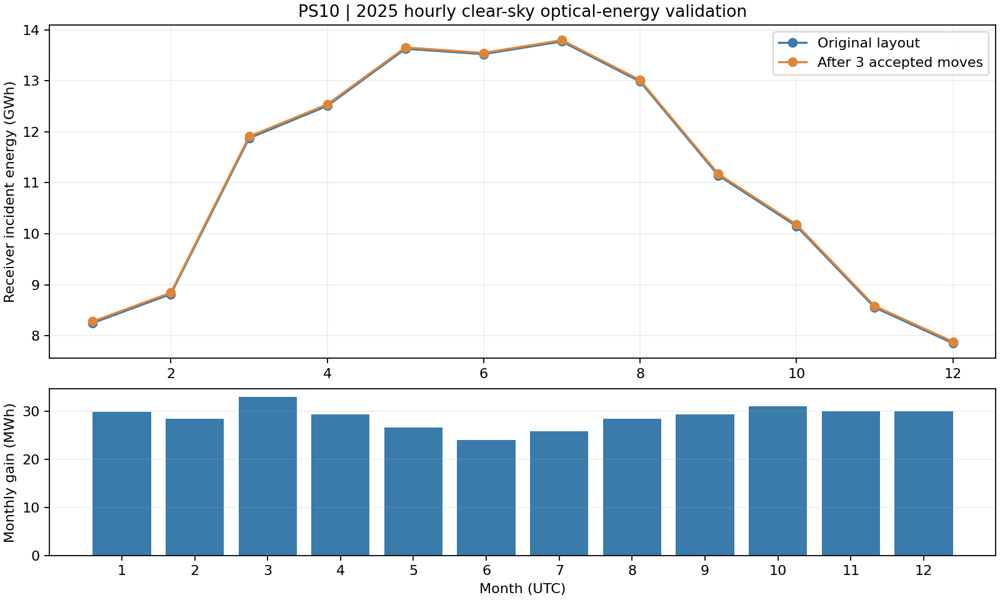

# PS10 年能量优化验证（2026-10-04）

采用目录中的 624 面镜重建布局及 2025 年晴空估算 DNI。完整数据覆盖 8,760 个 UTC 小时，其中 4,402 个有正 DNI 的白昼小时进入几何计算，其余小时的有效接收能量为零。

| 指标 | 原布局 | 优化后 |
|---|---:|---:|
| 完整逐时年接收器入射光学能量 | 133.062035 GWh | 133.407198 GWh |
| 年能量增益 | — | 345.163 MWh（0.259400%） |
| 分层近似年能量 | 133.032818 GWh | 133.378592 GWh |

月/当地小时分层筛选使用 151 个带时长权重的样本，保留原 DNI 小时积分。原布局分层评价相对逐时全年结果的误差为 -0.021958%，这是本算例的实际误差，不构成其他镜场误差界限。每轮考察全部镜面，候选排名前三的移动经完整全场复核，接受收益超过基线目标 0.001% 的最佳候选。移动前后均使用 64 阶接收器积分。

预算为 3 次移动，接受 3 次；完整逐时年复核通过。停止原因为移动预算耗尽，未宣称收敛或全局最优。代码包含全年收益下降时退回原布局的规则。



年接收器入射光学能量计算包含余弦、联合阴影遮挡、反射率、清洁度、沿程透过率及接收器截获。DNI 是晴空估算，几何为参数化重建；此结果不代表实测发电量、典型气象年或改造收益承诺。采用连续跟踪，未纳入启停滞回、可用率、储热和发电循环。

复算：

```bash
~/venv/bin/python -m scripts.optimize_field_greedy --plant ps10 --objective annual-stratified --max-moves 3 --annual-evaluation --output reports/ps10_annual_optimizer_2026-10-04
```

`annual_energy.json` 保存独立逐时复核及来源，`summary.json` 保存搜索指标，`move_history.csv` 保存逐轮移动，`ps10_greedy_layout.csv` 保存最终布局。
