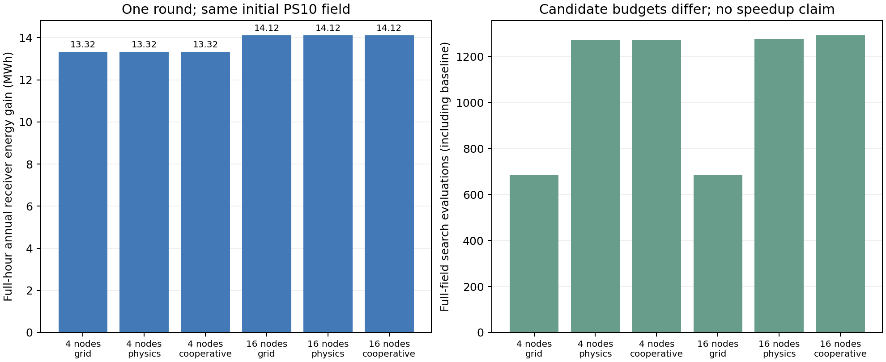

# PS10 APP 外镜场优化验算

本轮验证搜索和年度验收流程。固定 624 面镜子的尺寸、高度、光学参数与接收器，三种搜索都从同一目录重建布局出发；只运行一轮、步长 2 m。不是连续坐标空间全局最优或 SOTA 算法排名。

全年气象为 2025 年 pvlib 晴空估计，8760 个 UTC 小时中 4402 个有效日照小时。光学评分使用 shared_rust；年能量是接收器入射光能量，不是发电量。

| 搜索方向数 | 方法 | 全年能量增量 MWh | 全年相对增益 | 全场搜索评估数 | 搜索秒数 | 年度验收 |
|---:|---|---:|---:|---:|---:|---|
| 4 | grid | 13.3248 | 0.01001% | 685 | 24.40 | 通过 |
| 4 | physics | 13.3248 | 0.01001% | 1273 | 44.17 | 通过 |
| 4 | cooperative | 13.3248 | 0.01001% | 1273 | 88.90 | 通过 |
| 16 | grid | 14.1199 | 0.01061% | 685 | 144.82 | 通过 |
| 16 | physics | 14.1199 | 0.01061% | 1276 | 318.16 | 通过 |
| 16 | cooperative | 14.1199 | 0.01061% | 1292 | 350.45 | 通过 |

搜索耗时不包括全年复核；部分任务同时运行，用时只描述本轮执行，不能用于严格性能比较。评估次数更适合衡量本轮计算预算。物理模式保留四轴方向并增加提案，因此可能更慢；需要另做同预算收益曲线才能证明加速。

区域由 DNI 加权的潜在入射/反射光线耦合图提出。第一版仅取最强的 16 个镜对时，联合移动全部被保守间距约束排除；修正版跳过不能形成合法联合候选的镜对，并记录实际的联合评估数。4 方向结果保留为首版流程对照，16 方向协同结果使用可移动性筛选。

- 4 方向 grid：基线年能量近似误差 -3.6134%；最终候选类型 single。
- 4 方向 physics：基线年能量近似误差 -3.6134%；最终候选类型 single。
- 4 方向 cooperative：基线年能量近似误差 -3.6134%；最终候选类型 single。
- 16 方向 grid：基线年能量近似误差 -0.6003%；最终候选类型 single。
- 16 方向 physics：基线年能量近似误差 -0.6003%；最终候选类型 single。
- 16 方向 cooperative：基线年能量近似误差 -0.6003%；最终候选类型 single。
  - 合法候选数：{"single": 1275, "pair_translate": 16}；相对该轮基线的最好收益 kWh：{"single": 15598.972137376666, "pair_translate": 5389.282041713595}。

若协同模式最终仍选择单镜，表示本轮定义的联合候选未胜过最佳单镜，不能据此声称协同算法提高了收益；也不能据此否定多轮、更大步长或三镜区域。保留年度增益阈值，并在失败时输出原布局。

边界使用初始镜子中心凸包，间距采用两镜半对角线之和再加 1 m，均是实验约束。未加入道路、禁入区、地形、实测气象、运行可用率或发电模型。后续应加密至全部月/小时节点，使用多步长与多轮，并在同等计算预算下比较。

原始结果：reports/ps10_external_search_2026-10-04/comparison.json, reports/ps10_external_search_feasible_2026-10-04/comparison.json.
