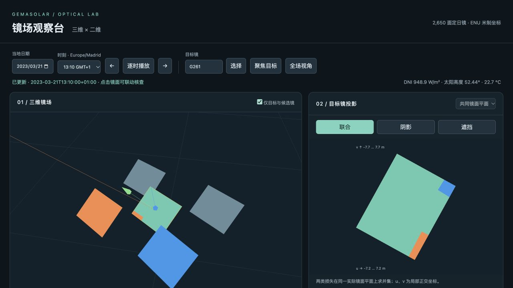

# 三维—二维交互界面验收

日期：2026-09-29。环境：用户 `~/venv`，本地浏览器 WebGL 2。

## 交付

启动：在仓库根目录执行 `~/venv/bin/python -m scripts.serve_viewer`，打开
http://127.0.0.1:8765 。前端依赖固定为 Three.js 0.180.0，随仓库存储，运行无需外网。

## 数值检查

`python -m pytest -q`：**120 passed**。新增 11 项测试覆盖：

- 孔洞与不连通多边形序列化后的面积守恒。
- 三个真实历史时刻、六面目标镜，与保存的逐镜阴影/遮挡/联合效率核对，绝对容差 1e-8。
- 实际镜面面积与沿太阳方向、目标反射方向的法向投影面积符合余弦缩放；有效面积比例保持不变。
- 共同镜面上的有效、仅阴影、仅遮挡、重叠四区面积收支闭合。
- 二维坐标回映后的三维顶点落在实际镜面平面。
- 候选镜判断记录和实际重叠镜 ID 集合一致。
- 夜间不生成跟踪姿态，非法时刻和镜号被拒绝；夏令时 23/25 小时日仍对应唯一 UTC 时间。
- 本地 HTTP 页面、元数据和错误响应。

## 浏览器实测

使用 Codex 内置浏览器操作本地页面，验证：

- 全场显示 2,650 面镜，聚焦 G261 后显示同一镜面的三维着色和二维区域；候选过滤有效。
- 点击三维橙色镜面，目标由 G261 更新为 G200，联合效率显示 97.50%；点击表格 G261 可返回。
- G261 在 2023-03-21 13:10（Europe/Madrid）显示阴影效率 97.08%、遮挡效率 96.34%、联合效率 93.42%。
- 共同镜面轮廓 119.998 m²、联合损失 7.900 m²；光线法向轮廓 108.852 m²。
- 阴影、遮挡及联合模式切换；单项可切换光线法向平面，联合模式恢复共同镜面坐标。
- 逐时播放从 13:10 前进，暂停于 16:10；G261 联合效率随时刻更新为 98.59%。
- 选择 00:10 后仅显示镜面中心，提示夜间效率不适用；返回 13:10 后恢复姿态与投影。
- 控制台 error/warn 日志为空。

首次构建一个全场时刻在本机约 1.2 秒；该数值是单次观测，不是跨硬件性能保证。

## 数据口径和剩余边界

使用公开研究重建布局及 PVGIS-SARAH3 2023 历史卫星 DNI/气温。界面重新计算所选时刻的几何，
而非在前端重写投影算法；接收器和塔柱仅提供空间参照，未引入新的塔身遮阴或通量计算。
全年小时采样可按需查看不等于已完成全年能量汇总。缓存最近三个时刻。
三维空间中的独立悬浮投影平面、空间索引加速及全年能量汇总继续保留在路线图。
